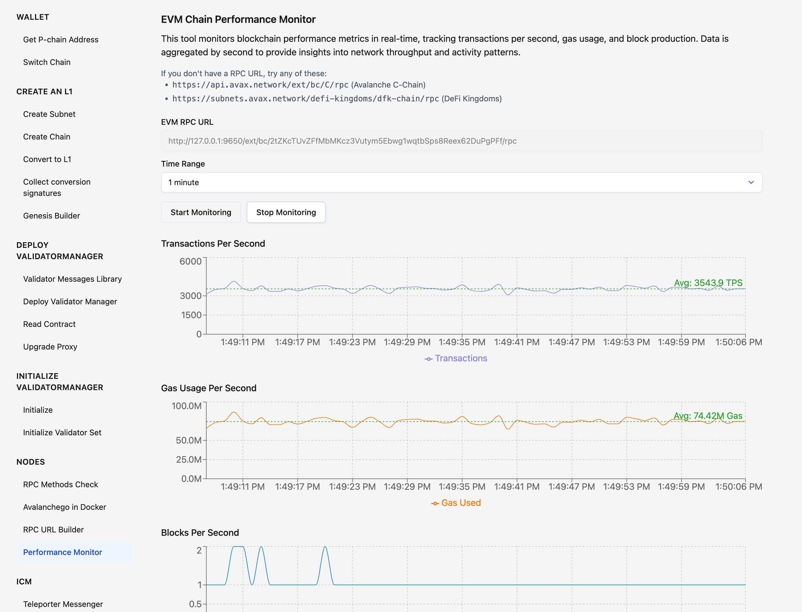

# evmbombard

Bombards your EVM with a constant stream of transactions

made for Avalanche L1s. learn how to lkaunch your own Avalanche L1 here
https://build.avax.network/

usage from repo if you clone it

go run . -rpc
"http://127.0.0.1:9650/ext/bc/2tZKcT/rpc;http://node2:9650/ext/bc/2tZKcT/rpc"
-batch 50 -keys 600

but better is `go install github.com/containerman17/evmbombard`

it uses address 0x8db97C7cEcE249c2b98bDC0226Cc4C2A57BF52FC as a root addresss.
it's a well known private key, therefore hardcoded.

then `evmbombard -rpc "RPC_URL" -batch 50 -keys 600`

this tool will provide a steady stream of transactions to your EVM chain in
batches of transactions.

max batch size isss 79, above that EVM nodes will start loosing transactions
during replication.

it works way better with multiple RPC nodes. Here is an example of what you can
easily achieve with 5 nodes in the same datacenter:



3543 TPS sustained over 1 minute

below is a guide how to launch your own Avalanche L1 for benchmarking:

1. Create 5 nodes on any cloud provider. I did it on AWS, 8 vCPU and 32GB RAM
   per node, but this is an overkill. Single core performance matters more than
   number of cores.
2. [Create a subnet in the toolbox](https://builders-hub-git-benchmark-ava-labs.vercel.app/tools/l1-toolbox#createSubnet)
3. [Create a chain here](https://builders-hub-git-benchmark-ava-labs.vercel.app/tools/l1-toolbox#createChain)

Please use the following genesis data:

```
{
  "config": {
    "chainId": 99999,
    "feeConfig": {
      "gasLimit": 600000000,
      "minBaseFee": 1000000000,
      "targetGas": 400000000,
      "baseFeeChangeDenominator": 48,
      "minBlockGasCost": 0,
      "maxBlockGasCost": 10000000,
      "targetBlockRate": 1,
      "blockGasCostStep": 500000
    }
  },
  "alloc": {
    "8db97C7cEcE249c2b98bDC0226Cc4C2A57BF52FC": {
      "balance": "0xC097CE7BC90715B34B9F1000000000"
    },
    "0x0Fa8EA536Be85F32724D57A37758761B86416123": {
      "balance": "0xC097CE7BC90715B34B9F1000000000"
    },
    "8db97C7cEcE249c2b98bDC0226Cc4C2A57BF52FC": {
      "balance": "0xC097CE7BC90715B34B9F1000000000"
    }
  },
  "nonce": "0x0",
  "timestamp": "0x5FCB13D0",
  "extraData": "0x00",
  "gasLimit": "0x23C34600",
  "difficulty": "0x0",
  "mixHash": "0x0000000000000000000000000000000000000000000000000000000000000000",
  "coinbase": "0x0000000000000000000000000000000000000000",
  "number": "0x0",
  "gasUsed": "0x0",
  "parentHash": "0x0000000000000000000000000000000000000000000000000000000000000000"
}
```

4. Launch the validators on each machine. Please not in my example I use tag
   v0.7.2-fuji, please replace it
   [with the latest stable tag from dockerhub](https://hub.docker.com/r/avaplatform/subnet-evm/tags?name=v)

Repalce REPLACE_THIS_WITH_YOUR_SUBNET_ID_FROM_STEP_1 with the subnet ID from
step 1.

Please note that this setup exposes your validators port 9650 to the public
internet, which should be fine for benchmarking, but don't do this in
production.

```bash
docker run -it -d \
    --name rpc \
    -p 9650:9650 -p 9650:9650 \
    -v ~/.avalanchego_rpc:/root/.avalanchego \
    -e AVAGO_PARTIAL_SYNC_PRIMARY_NETWORK=true \
    -e AVAGO_PUBLIC_IP_RESOLUTION_SERVICE=opendns \
    -e AVAGO_PLUGIN_DIR=/avalanchego/build/plugins/ \
    -e AVAGO_HTTP_HOST=0.0.0.0 \
    -e AVAGO_TRACK_SUBNETS=REPLACE_THIS_WITH_YOUR_SUBNET_ID_FROM_STEP_1 \
    -e AVAGO_HTTP_PORT=8080 \
    -e AVAGO_STAKING_PORT=9653 \
    -e AVAGO_NETWORK_ID=fuji \
    -e AVAGO_HTTP_ALLOWED_HOSTS="*" \
    avaplatform/subnet-evm:v0.7.2-fuji
```

5. Collect proof of posession from every node using this command:

```bash
curl -X POST --data '{"jsonrpc":"2.0","id":1,"method":"info.getNodeID"}' -H "content-type:application/json;" 127.0.0.1:9650/ext/info
```

6. [Convert the subnet+chain to L1 here](https://builders-hub-git-benchmark-ava-labs.vercel.app/tools/l1-toolbox#convertToL1)

You will need to provide proofs of posession from every node. keep weights and
balances the same. You will need 5 fuji avax for that. get it from the faucet
(https://test.core.app/tools/testnet-faucet/) and transfer via the
[cross chain transfer tool](https://test.core.app/stake/cross-chain-transfer/).

7. You are good to go, go get your thousands of TPS!
